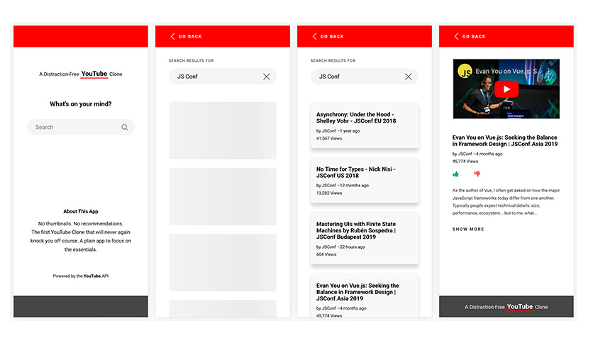

# A Distraction-Free YouTube Clone
> React.js - Built with the [YouTube Data API v3](https://developers.google.com/youtube/v3/)

A YouTube clone in its simplest form - search, watch, and enjoy. I built this small app to get familiar with Axios, React Hooks, Redux, Styled Components, and Skeleton Loaders. As always, if you find any bugs or issues, please let me know. I really like to hear your suggestions for improvements.

[Live Demo](https://adfy.realzaidmukaddam.tech/)



## Installation

```sh
git clone https://github.com/zaidmukaddam/a-distraction-free-youtube-clone
cd a-distraction-free-youtube-clone
npm install
npm start
```
